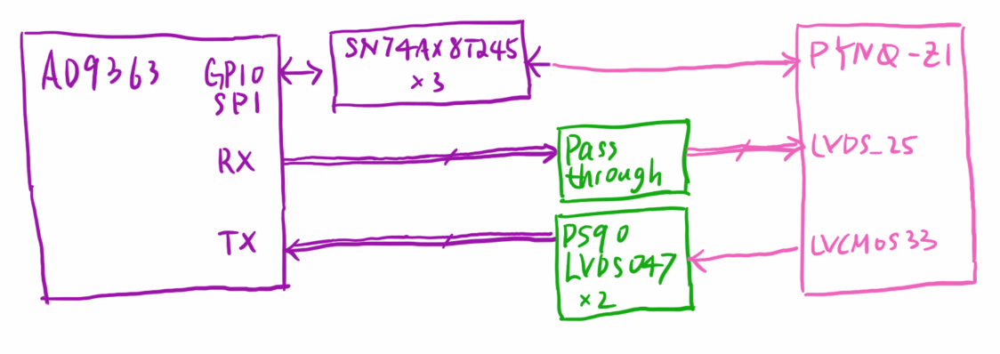

#### Design

*Maybe you should first have a look at AD9363 + ZYNQ schematics of [PlutoSDR](https://wiki.analog.com/_media/university/tools/pluto/hacking/plutosdr_schematic_revd_0.1.pdf), [ANTSDR](https://github.com/MicroPhase/antsdr-fw/blob/master/schematic/ant_e310_Public.pdf), and [kangyuzhe666's SDR](https://github.com/kangyuzhe666/ZYNQ7010-7020_AD9363).*

A series of "hacking" is required to get things work. 

- AD936X run on 1.8 V or 2.5 V, while most FPGA boards have VCCIO 3.3 V
  - Use level converters like SN74AX8T245. Changing VCCIO is not plausible because USB and ETH PHY need 3.3 V
- Wiring is both poor and long on FPGA boards
  - So have to use LVDS mode. Openwifi needs LVDS anyways
  - Have to stick to 1RX 1TX. But that's enough for most applications
- But ZYNQ with 3.3 V HP VCCIO can't run LVDS
  - For receiving, HDMI can run TMDS_33. So re-drive using SN65CML100
  - For sending, I use single-ended output on FPGA, and convert these to LVDS using DS90LVDS047
- PMOD can't run high speed
  - Yet it can run at 80 MHz, enough for openwifi, dump1090, and everything else I tried
  - Optionally remove TVS diodes and 200 ohm series resistors, can run at 120 MHz
- Board shape is strange...
  - Small connectors on PMOD/HDMI side is required
- Hand-solder BGA?
  - Heatgun, soldering iron, solder paste, flux are enough, it's really not that hard

Design "explained":

#### Future plan

Since I'm confident unmodified PYNQ-Z1 can make it, board version 1.0 will be designed and sent to fabrication and SMT assembly before Dec 31, 2021. 5 boards are to be made. 

If the 5 boards turn to be OK, more will be coming. 